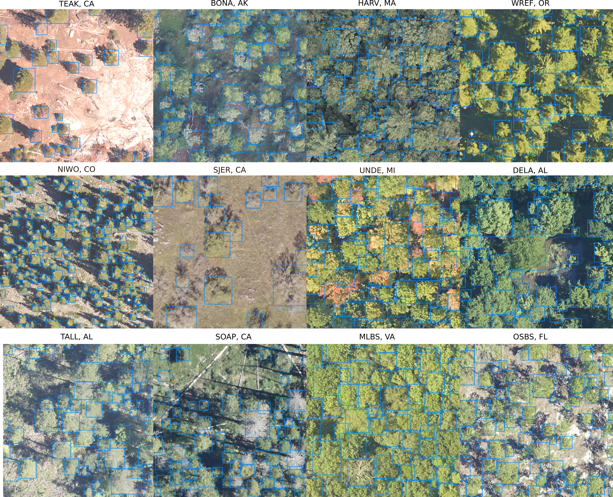
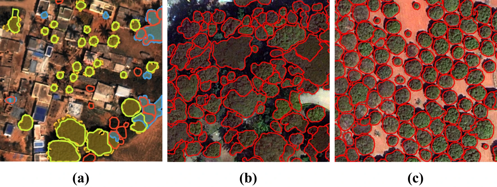

# Object Detection Models

## Description

This repository provides implementations for two deep learning models used in remote sensing and forestry:

### 1. **[DeepForest](https://github.com/weecology/DeepForest)** 

         
   
A model for tree detection using a RetinaNet-based architecture. This repository contains the code necessary to run a [RetinaNet](https://arxiv.org/abs/1708.02002) based on the [DeepForest](https://github.com/weecology/DeepForest) implementation. 
The implementation uses the PyTorch DeepLearning framework. RetinaNet is used to detect objects within an image. The repository contains all code necessary to preprocess large tif-images, run training and validation, and perform predictions using the trained models.

### 3. **[UNet Detection](https://github.com/AWF-GAUG/TreeCrownDelineation)** 

A model for individual Tree Crown Delineation via Neural Networks.

  


## Scripts:

- `deepforest_main.py`: Runs the DeepForest model for tree detection.
- `delineation_main.py`: Runs the UNet-based model for crown delineation.

---

## Installation

### Dependencies

- **Required Libraries**: DeepForest, GDAL, PyTorch, PyTorch-Lightning, SciPy, etc. (details below).
- **Hardware**: A CUDA-capable GPU ([overview here](https://developer.nvidia.com/cuda-gpus)).
- **Environment**: Developed and tested on Windows 10.
- **Package Manager**: Anaconda ([download here](https://www.anaconda.com/products/distribution)).

### Setup

1. Clone the repository:
   ```bash
   git clone https://github.com/your-repo-link.git
   cd your-repo-folder
   ```

2. Create and activate environments:

   For **DeepForest**:
   ```bash
   conda create -n DeepForest python=3.11
   conda activate DeepForest
   pip install torch torchvision torchaudio --index-url https://download.pytorch.org/whl/cu118
   cd ../UNet/environment
   pip install -r requirements.txt
   ```

   For **UNet Detection**:
   ```bash
   conda create -n UNet python=3.11
   conda activate UNet
   conda install gdal pytorch torchvision pytorch-cuda=11.8 -c pytorch -c nvidia
   pip install git+https://git@github.com/AWF-GAUG/TreeCrownDelineation.git
   cd ../UNet/environment
   pip install -r requirements_2.txt
   ```
---

## Known Issues

- None reported yet. Please raise any issues via the repository.

---

## Authors

- [Benjamin Stöckigt](https://github.com/benjaminstoeckigt)
- [Shadi Ghantous](https://github.com/Shadiouss)
- [Malik-Manel Hashim](https://github.com/irukandi)

---

## Acknowledgments

- [DeepForest](https://github.com/weecology/DeepForest)
- [DeepForest Documentation](https://deepforest.readthedocs.io/en/latest/)
- [RetinaNet paper](https://arxiv.org/abs/1708.02002)
- [Tree Crown Delineation](https://github.com/AWF-GAUG/TreeCrownDelineation)


